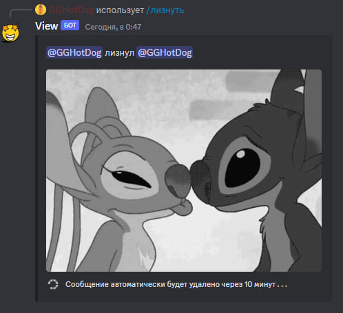

<br/>
<p align="center">
  <a href="https://github.com/GGHotDog/View">
    
  </a>

  <h3 align="center">View Bot</h3>

  <p align="center">
    Этот бот для дискорда позволит добавить эмоции на ваш сервер.
    <br/>
    <br/>
  </p>
</p>


## О проекте



Этот бот добавит реакции на ваш Discord сервер такие как:
 * /есть
* /петь
* /пить
* /обнять
* /укусить
* /лизнуть
* /злиться
* /тыкнуть
 
* /плакать
* /ударить
* /смеяться
* /похлопать
* /наблюдать
* /прижаться
* /поцеловать
* /пощекотать
 
* /плакать
* /ударить
* /смеяться
* /похлопать
* /наблюдать
* /прижаться
* /поцеловать
* /пощекотать

## Создан на

Проект реализован на Python при помощи библиотеки discord.py


## Зависимости

Для работы вам понадобится Python 3 и зависимости для него:

* discord.py

```sh
pip3 install discord.py
pip3 install discord-py-interactions
pip3 install py-cord
```

## Установка

1. Получаем дискорд токен на странице https://discord.com/developers/applications/

2. Приглашаем бота на сервер и выдаём необходимые права

3. В файле ```src/config.py``` в строке ```token = 'TOKEN'``` вводим наш токен

4. Запускаем бота командой ```python3 main.py``` в директории ```src```

## Использование

После установки и надписи ```ready``` в консоли, бот работает и поддерживает слеш-команды.


## Автор

* [GGHotDog](https://github.com/GGHotDog)